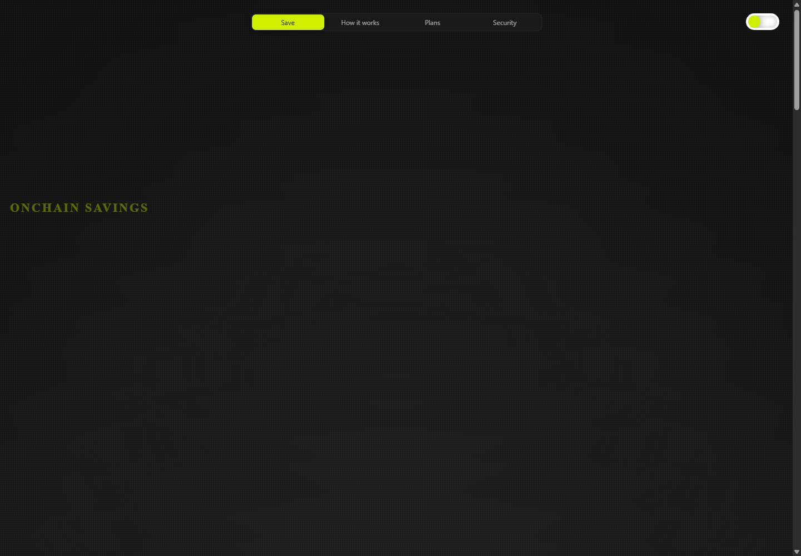

<p align="center">
  
</p>

# Rixor

**Onchain savings with clear terms, wallet-native control, and testnet-first execution.**

Rixor is a wallet-connected savings experience built around a simple idea: a user should be able to move testnet ETH into an onchain balance, place part of that balance into a savings plan, understand the lock and early-exit rules before signing, and see the resulting activity directly from contract state and events.

The current build supports **Sepolia** and **Robinhood Chain Testnet**. It is a testnet product and should not be treated as a production mainnet savings protocol.



## What is working

- Connect an injected EVM wallet.
- Switch between Sepolia and Robinhood Chain Testnet.
- Read the wallet's native testnet ETH balance.
- Deposit testnet ETH into the Rixor contract.
- Create Flexible, 30-day, 90-day, 180-day, and 1-year savings plans.
- View active plans from onchain state.
- Top up an active plan from the user's Rixor available balance.
- Extend an active plan to a longer lock period.
- Withdraw the available Rixor balance back to the connected wallet.
- Exit an active plan, including a declining early-withdrawal fee for locked plans.
- Preview the early-exit fee, net ETH returned, and an approximate USD loss before signing.
- Read plan history and recent movement from contract events.
- Show wallet approval, pending, and transaction-confirmed UI states.
- Use chain-specific visual identity: Ethereum for Sepolia and the Robinhood feather for Robinhood Chain Testnet.
- Deploy the current contract bytecode from the connected wallet when a fresh testnet deployment is required.

## Screenshots

### Landing experience


### Plans


### Security


## Smart-contract behavior

The current Solidity contract is `contracts/RixorSavings.sol`.

Core actions:

| Action | Contract behavior |
| --- | --- |
| Deposit | Adds native ETH to the user's `availableBalance` |
| Withdraw available | Sends ETH from `availableBalance` back to the plan owner |
| Create plan | Moves ETH from `availableBalance` into a new savings plan |
| Top up plan | Moves additional ETH from `availableBalance` into an active plan |
| Extend plan | Moves an active plan to a longer supported term and starts the new lock period |
| Withdraw plan | Closes the plan and returns principal minus any applicable early-exit fee |

### Early-exit fee schedule

Locked plans use a maximum fee that declines continuously toward zero as the plan approaches maturity.

| Plan | Maximum early-exit fee |
| --- | ---: |
| Flexible | 0% |
| 30 days | 2% |
| 90 days | 4% |
| 180 days | 6% |
| 1 year | 8% |

At maturity the early-exit fee is zero. The UI shows the current percentage, ETH fee, approximate USD loss, and expected ETH returned before the user signs.

## Supported networks

### Sepolia

- Chain ID: `11155111`
- Native asset: testnet ETH
- Explorer: Sepolia Etherscan

### Robinhood Chain Testnet

- Chain ID: `46630`
- Hex chain ID: `0xb626`
- RPC: `https://rpc.testnet.chain.robinhood.com`
- Native asset used by the current Rixor contract: testnet ETH
- Explorer: Robinhood Chain Testnet Explorer

Rixor can store a freshly wallet-deployed contract address per chain in browser local storage under `rixor:testnet-contracts`. A locally saved deployment takes precedence over the fallback/configured address for that testnet.

## Architecture

```text
Rixor/
├─ contracts/
│  └─ RixorSavings.sol
├─ scripts/
│  ├─ compile-contract.mjs
│  ├─ deploy-contract.mjs
│  └─ test-contract.mjs
├─ src/
│  ├─ App.tsx
│  ├─ styles.css
│  └─ contracts/
│     └─ RixorSavingsArtifact.json
├─ public/
│  └─ images/
├─ docs/
│  ├─ PROJECT_REPORT.md
│  ├─ TESTER_GUIDE.md
│  └─ screenshots/
└─ vite.config.ts
```

Frontend state is intentionally hydrated from the connected wallet, contract reads, and emitted events rather than from a private account database.

## Tech stack

- React 19
- TypeScript
- Vite
- ethers v6
- Solidity `0.8.x`
- solc-js
- Ganache for local contract tests
- Native/injected EVM wallet provider APIs

## Local development

Requirements:

- Node.js
- npm
- An injected EVM wallet for live testnet interactions
- Test ETH on the selected supported network

Install and run:

```bash
npm install
npm run dev
```

Production build:

```bash
npm run build
```

Compile the contract:

```bash
npm run contract:compile
```

Run contract tests:

```bash
npm run contract:test
```

## Current validation status

Before this documentation update, the current workspace passed:

- `npm run contract:test`
- `npm run build`
- `git diff --check`

The contract test suite covers deposits, available-balance withdrawals, plan creation, plan ownership checks, top-ups, extensions, early exits, fee conservation, flexible-plan exits, maturity behavior, and protocol-fee access control.

## Important current limitation: `$RIXOR` rewards

The interface describes rewards in `$RIXOR`, but the current testnet contract **does not yet implement the final `$RIXOR` token, reward treasury, reward-controller, or vesting payout system**.

For this build:

- ETH principal accounting and savings-plan actions are real testnet contract behavior.
- `$RIXOR` reward presentation is product/UI direction rather than a live onchain reward payout.
- Testers should evaluate the existing ETH savings flows separately from the future reward-token implementation.

This distinction is intentional so the repository does not imply that an unfinished reward system is already live.

## Tester documentation

- [Detailed project report](docs/PROJECT_REPORT.md)
- [Tester guide](docs/TESTER_GUIDE.md)

## Status

**Current stage: functional testnet build / tester handoff.**

The next phase after external testing is to address tester feedback, harden failure/recovery states, and decide the production architecture for the `$RIXOR` reward system before any mainnet-oriented work.
